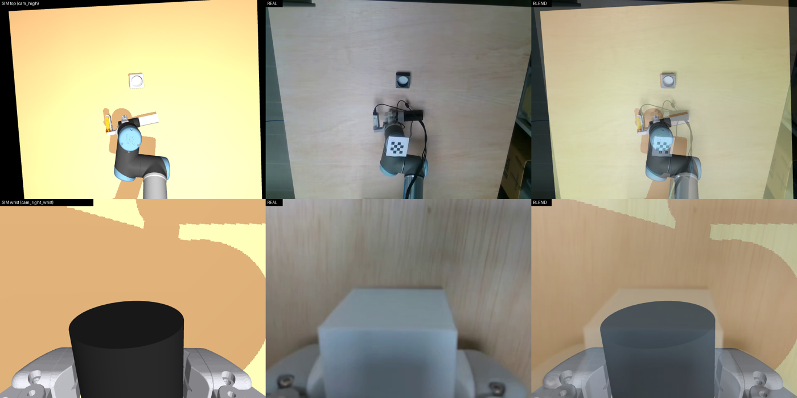
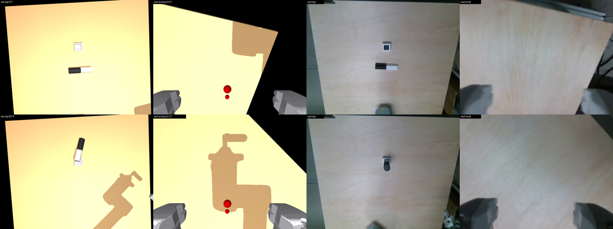

# ur10-mujoco-sim

A MuJoCo model of our UR10 pick-and-place workspace: the UR10 (CB3) arm, the 3D-printed **PincOpen** gripper (six-bar linkage, built from the CAD), the wrist camera (Intel D435i on its printed mount), the top camera, the wooden board, and the peg / hole blocks of the task-oriented-grasping experiments.
Everything is described by **one YAML file** (`ur10sim/scene_config.yaml`). Edit it, run one command, get camera images. It can also replay recorded LeRobot episodes in the simulation and render videos next to the real camera streams.



*(sim | real | 50 % blend, top camera above, wrist camera below; the sim is driven by the recorded joints of the same dataset frame)*

**Videos** (sim top | sim wrist | sim overview over the real top | real wrist cameras, 15 fps): [`docs/sqr_ep60.mp4`](docs/sqr_ep60.mp4), [`docs/circ_ep5.mp4`](docs/circ_ep5.mp4).

Contents: [Quick start](#quick-start) · [What is fixed, what you change](#what-is-fixed-and-what-you-can-change) · [Changing the scene](#changing-the-scene) · [Using it from Python](#using-it-from-python) · [Replaying datasets](#replaying-recorded-episodes) · [Frames & conventions](#frames-and-conventions) · [Provenance: measured vs assumed](#provenance-what-is-measured-and-what-is-assumed) · [Regenerating assets](#regenerating-the-assets) · [Troubleshooting](#troubleshooting) · [Licences](#licences-and-credits)

---

## Quick start

```bash
git clone <this repo> && cd ur10-mujoco-sim
python -m venv .venv && source .venv/bin/activate        # or conda
pip install -r requirements.txt                          # mujoco, numpy, scipy, pyyaml, pillow, pandas, pyarrow
sudo apt install ffmpeg                                  # only for dataset replays / videos

python ur10sim/scene_view.py                # renders the default scene -> ur10sim/out/{top,wrist,overview,all}.png
python ur10sim/scene_view.py --watch        # re-renders every time you save scene_config.yaml (camera-only edits ~0.2 s)
python ur10sim/scene_view.py --watch --window   # + a live tkinter window (works over ssh -X)
python ur10sim/scene_view.py --config my_scene.yaml            # any other config file
```

No GPU needed for the physics. Rendering uses an OpenGL backend, EGL by default; if that does not work on your machine use `--gl osmesa` or `--gl glfw` (see [Troubleshooting](#troubleshooting)).
Tested with MuJoCo 3.12 and Python 3.13 (developed against MuJoCo 2.3.7 as well; the code avoids version-specific calls).

Try the other example scenes / scripts:

```bash
python ur10sim/scene_view.py --config ur10sim/configs/example_custom_task.yaml   # no peg/holes, two extra objects
python ur10sim/examples/drive_joints.py                                          # use the scene as a library, move the arm + close the gripper
python ur10sim/wrist_mount_views.py                                              # the two ways the D435i fits on the mount, all lenses
```

## Repository layout

```
ur10sim/
  scene_view.py          render once / --watch / --window
  build_scene.py         library: config -> MJCF -> Scene object (physics + render); Scene.grasp_assist
  scene_config.yaml      <- THE FILE YOU EDIT: default scene (robot at home, no dataset needed)
  configs/               lab_dataset_frame.yaml (our tuned lab scene, needs the datasets) ; example_custom_task.yaml
  examples/              drive_joints.py (library use) ; extra_objects.xml (snippet for `include:`)
  replay_episode.py      replay a recorded episode (+ mp4)          replay_batch.py   summarise many episodes
  wrist_mount_views.py   D435i orientations/lenses                 sweep_mount_angle.py   wrist-camera mount angle sweep
  pincopen.py            gripper fraction <-> cam angle <-> jaw gap  (used by everything that drives the gripper)
  ur10_kinematics.py     nominal UR10 DH forward kinematics (the FK our datasets were converted with)
  assets/                GENERATED model files (MJCF, meshes, meta json) -- committed, you do not need to rebuild them
  build_*.py, find_pivots.py, register_mount.py, import_d435i.py   generators for assets/ (need cad/)
  verify_*.py            self-tests of the generated models
  fit_top_camera.py, compare_top_heights.py, tune_wrist_camera.py  calibration helpers we used for our cameras
cad/                     the CAD exports the generators read (gripper try2 assembly STLs, camera mounts, peg + hole blocks)
docs/                    figures and videos used by this README
```

---

## What is fixed, and what you can change

Think of the setup in two layers.

### Fixed hardware model (please do not edit unless the hardware changed)

| Part | Where | Notes |
|---|---|---|
| UR10 CB3 arm | `assets/ur10` | Official Universal Robots description (BSD-3). Its flange pose equals `ur10_kinematics.py` (the FK our datasets use) to 2e-10 (`verify_arm.py`). Nominal DH parameters, **not** this robot's calibration file. Driven kinematically: you give joint angles, the arm does not fall or collide. |
| PincOpen gripper, revision **try3** | `assets/pincopen`, `pincopen.py` | Six-bar linkage per finger from the CAD, closed loops as MuJoCo `connect` constraints, one actuator (`cam_act`) drives both fingers. Verified against an independent analytic solver (`verify_pincopen.py`). |
| Gripper calibration | `pincopen.py` | Recorded gripper value (0 open … ~0.57 holding the Ø41.5 end) ↔ cam angle ↔ jaw gap, fitted on the two grasp plateaus of our datasets. |
| Gripper mount on the flange | `assets/pincopen/pincopen_meta.json → mount` | Orientation and offset are partly **assumed**, see [Provenance](#provenance-what-is-measured-and-what-is-assumed). |
| Wrist camera hardware | `assets/wrist_camera`, `assets/d435i` | CAD camera mount (V2 / V6 reinforced) with the pivot bolt and the two M3 holes read from the CAD; D435i visual model from MuJoCo Menagerie. |
| Peg and hole blocks | `assets/peg_hole` | Peg 200 mm (square end 41.5 mm, round end Ø50), blocks 70×70×44 mm with 41 mm deep blind holes (Ø55.5 round, 46.7 square), masses 100 g / 50 g. |
| Frames and units | everything | Metres, degrees in configs, robot base frame (below). |

### Scene layer (what you change per task): `scene_config.yaml`

| Key | Meaning |
|---|---|
| `table.z, center_xy, size_xy, rgba` | Wooden board: top height (−2 mm here), centre and full size in the base frame. |
| `robot.source` | `home` (joints 0 −90 90 −90 −90 90), `joints` (`joints_deg` + `gripper_frac`), or `dataset` (joint + gripper values of one frame of a LeRobot dataset, see below). |
| `holes.circle/square` | `enabled`, `x`, `y`, `yaw_deg` of each hole block (opening up, sits on the table). `holes.fixed: false` makes the blocks free 50 g bodies. |
| `peg` | `enabled`; `mode: table` (lying on the table at `x`, `y`, `yaw_deg`; 0 = square→round along +x; physics settles it) or `mode: gripper` (held, pose relative to the gripper). |
| `include: [file.xml, …]` | Merge your own MJCF snippets (extra objects, fixtures) into the scene, see [below](#adding-your-own-objects). |
| `cameras.top` | Top camera (D415): `pos`, `look_at`, `up_hint` (or `rpy_deg`), extra `yaw_deg` (about world +z, anticlockwise from above), `roll_deg`, `fov_h_deg`. |
| `cameras.wrist.mount` | D435i on the printed mount: `version`, `angle_deg` (rotate the mount about its pivot bolt; 0 = CAD pose), `rgb_toward_z` (±1: the camera can only be screwed on two ways), `lens` (`rgb`/`ir_left`/`emitter`/`ir_right`). |
| `cameras.wrist.body_yaw_deg`, `fov_h_deg` | Rotate camera + mount as a whole about the tool axis; horizontal FOV (69° for the D435i RGB). |
| `cameras.overview` | A free debug camera. |
| `render.width/height/compare/settle_steps/out_dir` | Output size, sim|real|blend compare image (needs a dataset frame), physics steps to let objects settle, output folder (relative to `ur10sim/`). |

The file is heavily commented; the comments say where each number came from.

---

## Changing the scene

### Camera positions
Top camera: give a position and either `look_at` + `up_hint` (direction in the world that ends up at the top of the image) or `rpy_deg`. **Our top camera is mounted upside-down** (image-up = −y, image-right = −x): keep `up_hint ≈ [0, −1, 0]` if yours is too. With `--watch` running, edit and save, look at `out/top.png`. If you have a real frame from your camera, `robot.source: dataset` + `render.compare: true` gives a blend picture to line things up (`fit_top_camera.py` shows how we fitted ours by least squares on pixel measurements).

### Wrist camera
Do not place it by hand: it is part of the gripper assembly. Choose the mount `angle_deg` (the printed mount rotates about a bolt and stays at the angle you fix it), the D435i orientation (`rgb_toward_z`) and which lens is your image source. `python ur10sim/sweep_mount_angle.py -20 -10 0 10 20` renders a strip of wrist images for several angles; `wrist_mount_views.py` shows the two orientations with every lens labelled. Our setup: `angle_deg: -15`, `rgb_toward_z: 1`, RGB lens.
If you use a different camera holder, set `cameras.wrist.mount.enabled: false` and give a free camera in the gripper frame (`pos`, `look_at`, `up_hint`, `tilt_deg`, `fov_h_deg`; gripper frame = x fingers, y hinge axis, z jaw direction).

### Objects, table, robot pose
Just edit the numbers. To hide the peg or a hole block: `peg.enabled: false`, `holes.circle.enabled: false`. To start from a real robot pose use `robot.source: joints`.

### Adding your own objects
Put an MJCF snippet next to your config and list it under `include:`. Everything under `<default>`, `<asset>` and `<worldbody>` of the snippet is merged into the scene; mesh file paths are relative to the snippet. Use a `<freejoint>` for objects that should move.

```yaml
# my_scene.yaml  (start from ur10sim/configs/example_custom_task.yaml)
include: [my_objects.xml]
peg:   {enabled: false, ...}
holes: {circle: {enabled: false, ...}, square: {enabled: false, ...}}
```

`ur10sim/examples/extra_objects.xml` is a working example (a cube and a can). Object positions are in the robot base frame; the table top is at `table.z`.
Things that are specific to *our* peg task and that you will not need: `peg.*`, `holes.*`, `Scene.grasp_assist` (below), `replay_batch.py`.

### Using a different gripper
The gripper is generated by `build_pincopen.py` from the CAD. For a different gripper, build an MJCF that has a body named `pincopen_base` with the actuator `cam_act` and equalities like `assets/pincopen/pincopen.xml`, or fork `build_scene.build_xml`, where the gripper is attached to the flange in one place (search for `flange_dh`).

---

## Using it from Python

```python
import sys; sys.path.insert(0, "ur10sim")
import scene_view; scene_view._setup_gl("egl")     # choose the GL backend before importing mujoco
import numpy as np, mujoco
import build_scene as B, pincopen as PC

cfg = B.load_config("ur10sim/scene_config.yaml")   # a dict; edit it in code if you like
sc  = B.Scene(cfg)                                 # builds the MJCF, settles physics
m, d = sc.model, sc.data                           # ordinary mujoco MjModel / MjData
imgs = sc.render(640, 480)                         # {"top", "wrist", "overview"} uint8 RGB arrays
```

`ur10sim/examples/drive_joints.py` is a complete example. Points to know:

* **Kinematic arm.** Each physics step write the six joint positions `d.qpos[sc.arm_adr]` **and** velocities `d.qvel[sc.arm_dof]` (difference to the previous step / timestep) — the velocity is what lets contacts and friction carry objects. **Never jump the arm by more than a few mrad per 1 ms step**, interpolate (a jump makes the linkage or the contacts blow up).
* **Gripper.** One actuator: `d.ctrl[0] = PC.cam_angle_for_frac(frac)` with `frac` the recorded gripper value (0 = fully open, 0.57 ≈ holding the Ø41.5 mm end, 0.505 ≈ holding Ø50). Its torque is limited to 1 N·m, so it squeezes like the real current-limited servo. Rate-limit your target to ≲ 6 rad/s: a very fast closing can flip a finger to the wrong solution of the linkage.
* **Grasp assist.** The pads alone do **not** hold the lying peg in simulation (a sim-to-real gap we did not resolve). `sc.grasp_assist(want_grip)` welds the peg to the gripper once both pads touch it while `want_grip` is true, squaring it up between the pads, and releases when false. It is a documented correction; for other objects extend it or write your own.
* **Timestep** 1 ms, `implicitfast`; the scene model is rebuilt from the config in ~0.3 s.

---

## Replaying recorded episodes

The replay tools read **LeRobot v2.1 datasets** (parquet + mp4) with `observation.state` = 6 joint angles (rad) + gripper value, and cameras `cam_high` / `cam_right_wrist`. Point the tools at your dataset folder:

```bash
export UR10SIM_DATASETS=/path/to/folder/containing/dataset_dirs      # default: <repo>/datasets
python ur10sim/scene_view.py --config ur10sim/configs/lab_dataset_frame.yaml     # sim | real | blend for one frame
python ur10sim/replay_episode.py --dataset square_hole_v21_clean --episode 60 \
    --peg-x 0.01 --peg-y -0.662 --peg-yaw 0 --video out/ep60.mp4
python ur10sim/replay_batch.py --dataset circular_hole_v21_clean --n 10          # statistics over episodes
```

`replay_episode.py` replays the joints and the gripper value, lets the peg physics run (with the grasp assist), writes a montage PNG (`out/replay_*.png`) and, with `--video`, an mp4 of sim top | wrist | overview over the real top | wrist stream, and prints where the peg ends up relative to the hole at release.
The peg start pose in our lab is fixed (x 0.01, y −0.662 in the base frame) and only its yaw is 0 or 180°. The square-hole task grasps the **round** end, the circle task the **square** end: for the square task a recorded grasp at x > 0 means yaw 0; for the circle task x > 0 means yaw 180 (`replay_batch.py` applies this rule). Other tasks will need their own object placement and probably their own replay script — `replay_episode.py` is a good template.



Findings from replaying our 228 episodes: grasp x is bimodal (+0.09 / −0.07 m around a peg centre of 0.01), the peg is grasped horizontally and ends up vertical over the hole (tool axis horizontal at insertion), the lower end at release is 44–55 mm above the table (hole top is at 42 mm), 0–45 mm off the hole centre in xy, mostly because of the tilt in the hand. So the hole position (0.01, −0.87) is right to about ±2 cm; the real peg is guided into the hole by the chamfer/clearance, which a rigid carry cannot reproduce.

---

## Frames and conventions

* **Robot base frame** (the frame of the datasets, UR controller base): origin on the base mount plane, +z up, the arm reaches toward **−y** in our lab (holes at y ≈ −0.87, board from y = −0.11 to −1.26). Metres.
* **Flange frame**: UR DH frame 6 (`ur10_kinematics.py`); TCP = 145 mm along its z. This is the "TCP" all our datasets use; it is **not** the pad centre (the pad centre is 14.5 mm closer to the flange).
* **Gripper frame G**: origin on the cam axis, **x = fingers / tool axis**, **y = hinge axis** of the linkage (peg axis when grasped), **z = jaw (pinch) direction**. At home the tool points down, the hinge axis points along the base x axis, the jaws close along the base y axis.
* **Cameras**: `look_at`/`up_hint` or `rpy_deg` in the world; MuJoCo cameras look along their −z. Top camera image: up = −y, right = −x (upside-down mount). Wrist image comes from the D435i RGB lens whose image is right = −x_model, up = +y_model (model frame from Menagerie).
* **Gripper value**: 0 = open (88 mm predicted jaw gap), larger = closer; plateaus 0.569 (Ø41.5 held) and 0.505 (Ø50 held).

---

## Provenance: what is measured and what is assumed

Please read this before trusting a number.

**Measured / derived from CAD or data (high confidence)**
* Gripper linkage geometry (pivot positions measured as circular holes in the CAD meshes); jaw gap vs cam angle checked against an independent analytic solver to 0.04 mm.
* Peg / hole dimensions (CAD).
* UR10 kinematics (official description; matches the DH FK).
* Camera mount pose in the gripper frame and screw-hole positions (ICP of the print mesh onto the assembly export, rms 0.25 mm). A useful independent check: with the RGB lens toward the tips and `angle_deg: 0` the TCP projects to the middle of the image at 112 mm depth, i.e. the CAD design does aim at the middle of the tips.
* Board size/height (user measurements), peg/hole positions (from 228 recorded episodes).
* Top-camera pose: least-squares fit to pixel measurements of a real frame (107 cm height beats 78 cm clearly; FOV 65°; the tilt is poorly constrained), then yaw 1.5° / roll −2.5° tuned by edge correlation (yaw and roll trade off).

**Assumed or tuned by eye (check for your hardware)**
* **Mount orientation sign**: the hinge axis is assumed to point toward the base at home (`MOUNT_SIGN`). The wrist images match the real ones with this and `body_yaw_deg: 0`, which is reassuring, but it is not an independent measurement.
* **Flange offset along the tool axis** (5.7 mm shift, `MOUNT_ARM_BACK_X_A` in `build_pincopen.py`) is fitted so that the pads straddle the lying peg: the dataset TCP is 13–16 mm below the peg axis at grasp.
* **Open gap**: the calibration predicts 87.9 mm at gripper value 0; please measure your gripper (the older "80 mm" figure does not fit the linkage).
* **D435i image orientation** (RGB lens on the right seen from the front) and the D435i mounting hole positions (centred on the plate holes).
* Wrist mount angle −15° (by eye against real frames), which lens is used, whether the hole blocks are fixed to the table (assumed fixed), surface frictions (guesses), inertias of the arm and of the gripper base (placeholders; the arm is kinematic).
* The pads only hold the peg with the grasp assist.

**Not modelled**: the printed `Camera_basement` / `mobile_sup` parts (only SolidWorks parts, no STL), cables, the xense tip, real servo dynamics, compliance of the real peg.

---

## Regenerating the assets

`ur10sim/assets/` is committed; you only need to regenerate if you change the CAD, the calibration constants or the mount:

```bash
python ur10sim/build_pincopen.py     # gripper MJCF/URDF/meta (constants at the top: pad thickness, plateaus, mount offset, MOUNT_SIGN)
python ur10sim/build_peg_hole.py     # peg + hole blocks
python ur10sim/build_wrist_camera.py # camera mount in the gripper frame (needs register_mount.py)
python ur10sim/build_ur10.py         # UR10 from assets/ur10/source (upstream description + DAE meshes)
python ur10sim/import_d435i.py       # needs a checkout of mujoco_menagerie: MENAGERIE_D435I=/path/to/mujoco_menagerie/realsense_d435i
# checks
python ur10sim/verify_arm.py && python ur10sim/verify_pincopen.py && python ur10sim/verify_peg_hole.py
```

Regenerating from `cad/` reproduces the committed assets (checked for the gripper, peg/holes, wrist camera and UR10; `import_d435i.py` needs an external Menagerie checkout and was not re-run). `cad/` contains only the files the generators read (gripper try2 assembly export, camera mount STLs, peg/hole STLs), not the full SolidWorks folders.

## Troubleshooting

* **EGL errors / black or no image.** On multi-vendor Linux boxes only the NVIDIA EGL vendor may work: `scene_view.py` sets `__EGL_VENDOR_LIBRARY_FILENAMES=/usr/share/glvnd/egl_vendor.d/10_nvidia.json` if that file exists and picks the GPU with the most free memory (`MUJOCO_EGL_DEVICE_ID` overrides; the context needs ~150 MB). No NVIDIA GPU: `--gl osmesa` (needs `libosmesa6`) or `--gl glfw` (needs a display).
* **`Nan, Inf or huge value in QACC`** printed by MuJoCo: the kinematic arm was jumped or a finger flipped; interpolate joint targets over the 1 ms steps and rate-limit the gripper (see [Using it from Python](#using-it-from-python)).
* **Gripper looks like blobs / spheres**: mesh geoms need `type="mesh"` in older MuJoCo versions; already handled in `assets/`, but keep it in mind if you add snippets.
* **Cannot find dataset**: set `UR10SIM_DATASETS`, folder layout `<name>/data/chunk-000/episode_000000.parquet` and `<name>/videos/chunk-000/observation.images.cam_high/episode_000000.mp4`.
* **`--window` needs `$DISPLAY`** and tkinter; falls back to PNG watching otherwise.
* **Grasped peg slips / drifts during teleop, especially fast wrist rotation**: a known limitation of `Scene.grasp_assist`'s `hang_under_gravity` correction, gated but not eliminated -- see `peg.hang_max_gripper_radps` in `scene_config.yaml` and the 2026-09-29 entry in `ur10_agent/CHANGELOG.md` (upstream repo) for the measurements and the tradeoff of tightening it further.
* **Peg pose goes to NaN / the peg visually disappears**: `grasp_assist` now detects this and force-releases + resets to the last good pose instead of propagating it, but if you still see it happen, that's the underlying instability, not just this recovery path -- worth reporting with the joint trajectory that triggered it.

## Licences and credits

See [`NOTICE.md`](NOTICE.md). The UR10 description is BSD-3 (Universal Robots A/S), the D435i model is from MuJoCo Menagerie (Apache-2.0). The gripper, camera-mount, peg and hole CAD are our own lab designs; add the licence you want for the rest of the repository.
